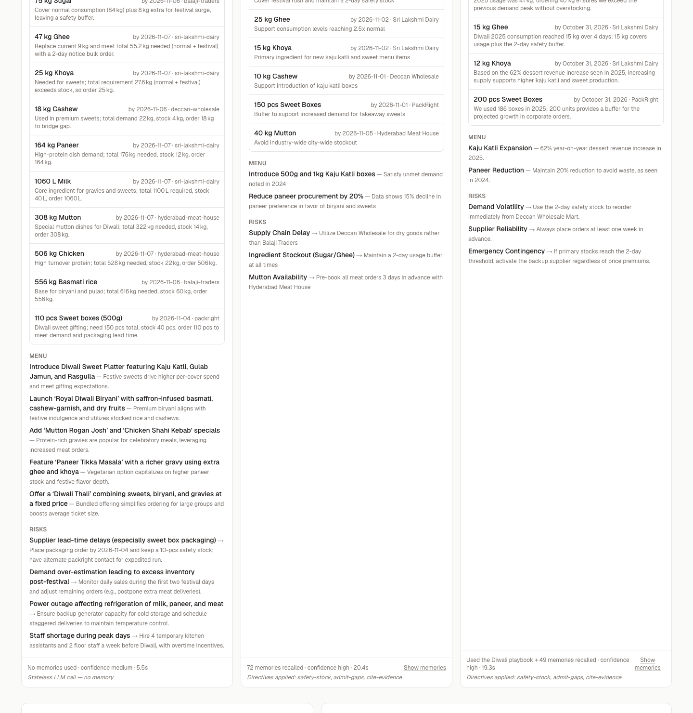
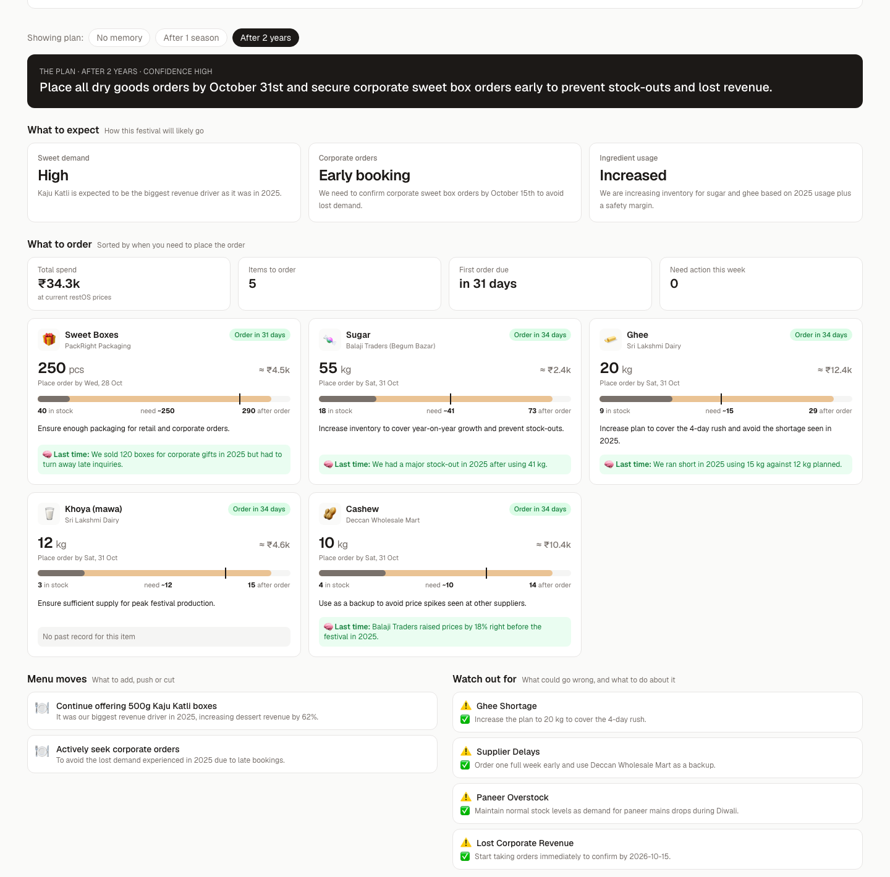

# restOS Foresight

**Festival demand memory for restaurants. Hindsight gives your kitchen foresight.**

In Hyderabad, a restaurant's biggest days are festivals: Dasara, Diwali, Ramzan, New Year's Eve. They are also when it runs out of things. Sugar hits zero at 7pm on the second day of Diwali. Mutton is gone by 8pm on Dasara, and no butcher in the city can top you up. Forty people ask for kaju katli you don't make.

Next year nobody remembers any of it. Sales data only records what sold, not what you couldn't sell. Festivals also move every year on the lunar calendar, so "same week last year" queries miss.

Foresight is an agent for restOS outlets. It keeps the operational memory of every festival: stock-outs, waste, supplier delays, unmet customer requests, and its own past plans with how they turned out. It then uses that memory to write the next festival's prep plan.



Each plan opens as cards an owner can act on: what to expect, what to order and by when, how it covers the likely need, what it costs, and what happened last time.



## The story, then the demo

`/` is a one-minute scroll story: the night the sugar ran out at 7:05pm on Diwali 2024, why no system caught it, how Foresight remembers, and the readiness learning curve. Every number comes from the outlet's history and the saved demo plans. **Watch it live** opens the dashboard at `/live`.

## The demo in one screen

The Diwali 2026 plan is generated three ways from **the same stock, suppliers and model**:

| Column | Memory | Diwali 2026 plan (real output) |
|---|---|---|
| No memory | none (stateless LLM) | Forgets sugar entirely before Diwali. Orders 46 kg chicken and 26 kg mutton "for festive dishes". For Dussehra it orders 197 kg mutton and 339 kg chicken, all due today. |
| After 1 season | Dussehra + Diwali 2024 | 45–60 kg sugar a week early, adds kaju katli boxes, cuts paneer, keeps Deccan Wholesale as backup. Right direction, rough numbers. |
| After 2 years | 46 events, plans and outcomes | Sizes sugar from the 41 kg actually used in 2025, raises ghee to 22 kg because 15 kg ran out, buys cashew from Deccan after Balaji's 18% spike, orders 250 boxes (186 used last year) and says to call last year's corporate clients now. |

Then you **teach it** something new from the floor ("20 regulars asked for sugar-free sweets"), re-run, and the plan adds sugar-free and jaggery sweets, citing that note. `npm run demo:reset` removes live-taught notes so the demo can be repeated.

Open `/live?run=1` (or `/live?run=1&festival=dussehra`) to plan all three columns on load.

### Would each plan have been enough?

The comparison scores every plan against the outlet's **likely need**: what it actually used last Diwali, plus last year's festival revenue growth (+39%), both from restOS records.

| | Readiness | Short on |
|---|---|---|
| No memory | 37% (spends ₹69k, still short) | sugar, ghee, cashew, sweet boxes |
| After 1 season | 86% | ghee, sweet boxes |
| After 2 years | 100% | — |

Readiness is computed in the browser from the plan and restOS stock ([`components/compare-charts.tsx`](components/compare-charts.tsx)), not by the model. Plans vary a little between runs, so exact numbers shift.

## How Hindsight is used

Hindsight is the core of the agent. Without it there is only the left-hand column.

| Hindsight feature | Where | Why |
|---|---|---|
| **Memory banks** | [`lib/hindsight.ts`](lib/hindsight.ts) | One bank per outlet. A second snapshot bank (`season1`) holds only the first season, to show the learning curve. |
| **Retain with timestamps + tags** | [`scripts/seed.ts`](scripts/seed.ts), [`app/api/memory/route.ts`](app/api/memory/route.ts) | Every restOS event is retained with its real date and tags (`festival:diwali`, `item:sugar`, `supplier:balaji-traders`, `kind:stockout`), so temporal recall works ("last Diwali") even though Diwali's date moves. |
| **Experience vs world facts** | `eventContext()` | Foresight's own plans and outcomes are retained as *its* experience. It learns whether its own advice worked, not just what happened. |
| **Reflect with structured output** | [`lib/planner.ts`](lib/planner.ts) | `reflect()` reasons over the memories, applies the bank's directives and returns a plan matching a Zod-derived JSON Schema. `includeFacts` returns the memories it relied on, which the UI shows as evidence. |
| **Recall (TEMPR)** | [`lib/planner.ts`](lib/planner.ts) | Runs alongside reflect so the UI can show what semantic + keyword + graph + temporal retrieval surfaced. |
| **Observations** | [`app/api/memory/route.ts`](app/api/memory/route.ts) | Hindsight consolidates raw events into beliefs ("Diwali sugar use is ~4x normal") with proof counts. Shown in *What it has learned*. |
| **Mental model** | [`app/api/playbook/route.ts`](app/api/playbook/route.ts) | A "Diwali playbook" that Hindsight rewrites from memory on demand. |
| **Mission + directives** | [`lib/hindsight.ts`](lib/hindsight.ts) | Hard rules: cite the past event behind every recommendation, admit when there is no history, never plan below two days of safety stock. |

## Architecture

```
restOS events ──retain──▶  Hindsight bank (per outlet)  ◀──recall / reflect──  Foresight planner ──▶ prep plan
(stock-outs, waste,          facts · experiences ·                              (Next.js route)        orders · menu · risks
 supplier delays,            observations · mental model                             │
 unmet requests,                                                                     └── Groq (gpt-oss-120b): no-memory baseline
 plans & outcomes)                                                                         and JSON repair fallback
```

- `data/` holds the synthetic restOS snapshot (outlet, stock, suppliers) and 46 historical events across Dussehra, Diwali, New Year's Eve, Sankranti, Ramzan, Bonalu and Ganesh Chaturthi (Oct 2024 - Sep 2026).
- `lib/planner.ts` builds the same live context for every mode, then either calls the LLM directly (no memory) or runs Hindsight recall + reflect.
- `lib/llm.ts` calls Groq with Zod validation and a bounded retry loop that feeds the validation error back to the model.

### Edge cases handled
- Groq returns malformed JSON or drops fields → schema validation, error fed back, up to 3 attempts.
- Reflect returns prose without `structured_output` → the text is converted to the plan schema instead of failing the request. The UI notes that this happened.
- Hindsight or Groq unavailable / keys missing → each panel shows the error; the rest of the page keeps working.
- Repeat views never re-spend credits: results are cached per plan and festival, and invalidated when memory changes.
- Seeding is idempotent: every event has a stable `document_id`, so re-running replaces rather than duplicates.

## Run it

```bash
npm install
cp .env.example .env        # add HINDSIGHT_BASE_URL, HINDSIGHT_API_KEY, GROQ_API_KEY
npm run seed                # creates both banks and retains the history (a few minutes)
npm run dev                 # http://localhost:3000 (story) and /live (dashboard)
npm run demo:reset          # optional: forget notes taught live from the UI
```

### Saved results (no credits spent on repeat views)

Plans, the learned-memory list and the playbook are cached in `.cache/foresight.json` ([`lib/cache.ts`](lib/cache.ts)). Opening the page or pressing **Plan all three** serves saved results instantly; **↻ Hard refresh** (or a card's **Re-run**) regenerates and uses API credits. Teaching a note clears the saved full-memory plans automatically.

- `npm run cache:snapshot` copies the current cache to `data/demo-cache.json`, which a fresh deployment starts from, so visitors see complete plans without spending credits.
- `npm run cache:clear` empties the local cache (restart the dev server afterwards).

Hindsight can be [Hindsight Cloud](https://ui.hindsight.vectorize.io) or [self-hosted](https://github.com/vectorize-io/hindsight). `npm run seed -- --reset` rebuilds the banks from scratch.

## Path to production

Foresight is built to sit behind restOS, which already emits every signal it needs: inventory movements (purchase, waste), purchase-order delivery dates, and the outlet's customer assistant, which records requests for items that aren't available. Production wiring is a restOS webhook subscriber that calls `retain` on each event, plus a scheduled job that asks for a plan 30 and 7 days before each festival in the outlet's calendar.

The same memory pattern works for any business with seasonal spikes: cloud kitchens, sweet shops, bakeries, D2C food brands and pharmacies.

## Links

- [Hindsight on GitHub](https://github.com/vectorize-io/hindsight)
- [Hindsight docs](https://hindsight.vectorize.io/)
- [What is agent memory?](https://vectorize.io/what-is-agent-memory)
